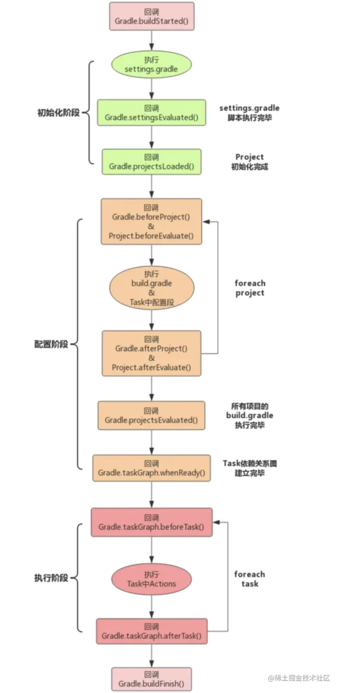

== groovy-study

enjoy groovy and gradle

[%hardbreaks]
Gradle 构建流程主要分为三个阶段：
1、初始化阶段
Gradle 初始化阶段主要就是执行 settings.gradle 脚本，构建 Project 对象
1)指定项目根 Project 的名称
2)使用 include 导入子工程
2、配置阶段
Gradle 配置阶段主要就是解析 Project 对象(build.gradle 脚本文件)，*构建 Task 有向无环图*
https://docs.gradle.org/current/javadoc/org/gradle/api/execution/TaskExecutionGraph.html[Interface TaskExecutionGraph]
3、执行阶段
Gradle 执行阶段主要就是执行 Task 及其依赖的 Task

1、Gradle 对象：在项目初始化时构建，全局单例存在，只有这一个对象
2、Project 对象：每一个 build.gradle 都会转换成一个 Project 对象
3、Settings 对象：Seetings.gradle 会转变成一个 Seetings 对象

== reference

[%hardbreaks]
https://docs.gradle.org/current/javadoc/org/gradle/api/initialization/Settings.html[Interface Settings API]
https://juejin.cn/post/6986191903888769032[Gradle 系列 （二）、Gradle 技术探索]

